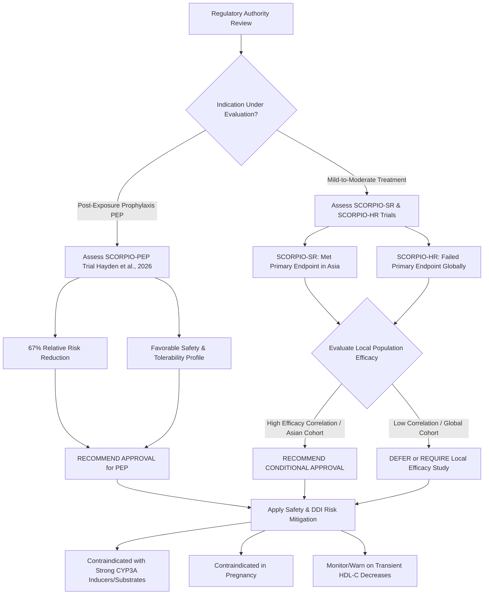

# Global Regulatory Review of Ensitrelvir (Xocova): Clinical Trials, Peer-Reviewed Evidence, and Approval Recommendations for International Authorities

**Report Date:** June 5, 2026  
**Author:** Antigravity AI, Clinical & Regulatory Intelligence Unit  
**Status:** Complete / Final  

---

## 1. Executive Summary

Ensitrelvir fumaric acid (brand name **Xocova**, developed by Shionogi) represents a major pharmacological milestone as the first single-entity, non-peptidic, non-covalent severe acute respiratory syndrome coronavirus 2 (SARS-CoV-2) main protease ($3\text{CL}$ protease) inhibitor. On **June 1, 2026**, the U.S. Food and Drug Administration (FDA) approved ensitrelvir specifically for the **post-exposure prophylaxis (PEP)** of COVID-19 in patients aged 12 years and older (Hayden et al., 2026). In Japan, the Pharmaceuticals and Medical Devices Agency (PMDA) has granted standard approvals for both **treatment** (March 2024) and **PEP** (March 2026) (Syed, 2024).

Despite these milestones, international regulatory bodies—including the European Medicines Agency (EMA), China’s National Medical Products Administration (NMPA), and South Korea's Ministry of Food and Drug Safety (MFDS)—face a complex, two-sided clinical dossier when evaluating ensitrelvir for marketing authorization.



### Key Regulatory Findings:
*   **Highly Effective for Prevention (PEP):** The landmark Phase 3 **SCORPIO-PEP** trial demonstrated a **67% relative risk reduction** in developing symptomatic COVID-19 in household contacts (Hayden et al., 2026). This represents a significant breakthrough, as competitor oral antivirals (e.g., Paxlovid) failed in the post-exposure prophylactic setting.
*   **Mixed Efficacy for Acute Treatment:** While the Phase 3 **SCORPIO-SR** trial (conducted in Japan, South Korea, and Vietnam) met its primary endpoint by reducing Omicron symptom resolution time by approximately 24 hours (Yotsuyanagi et al., 2024), the global Phase 3 **SCORPIO-HR** trial (conducted in a diverse non-hospitalized population) **failed to meet its primary endpoint** of sustained resolution of 15 symptoms (Luetkemeyer et al., 2025).
*   **No Ritonavir Boosting Required:** Unlike Paxlovid (nirmatrelvir/ritonavir), ensitrelvir does not require ritonavir co-administration, eliminating the associated ritonavir-induced taste disturbances and significantly lowering (though not eliminating) the complexity of drug-drug interactions.
*   **Notable Safety Signals:** Clinical trials consistently identify a transient, dose-dependent decrease in high-density lipoprotein cholesterol (HDL-C) affecting over 30% of recipients (Yotsuyanagi et al., 2024), alongside mild elevations in triglycerides and bilirubin (Ul Haq et al., 2025). Ensitrelvir is also a strong CYP3A inhibitor and is contraindicated during pregnancy due to animal teratogenicity.

> [!IMPORTANT]
> **Core Regulatory Recommendation:** International regulatory authorities should adopt a **stratified approval framework**. Ensitrelvir should be approved for **Post-Exposure Prophylaxis (PEP)** in individuals $\ge 12$ years old due to clear, robust efficacy. However, standard **Treatment** approval for mild-to-moderate COVID-19 should be restricted to high-risk cohorts or conditionally deferred until local bridging studies or post-marketing efficacy data resolve the symptom-resolution discrepancies observed between the Asian (SCORPIO-SR) and Global (SCORPIO-HR) cohorts.

---

## 2. Pharmacological & Mechanism of Action Profile

Ensitrelvir (S-217622) is an orally bioavailable, small-molecule inhibitor of the SARS-CoV-2 main protease ($3\text{CL}^\text{pro}$ or $\text{M}^\text{pro}$), which plays an essential role in viral replication by cleaving polyproteins translated from viral RNA.

```
                   [ Ensitrelvir (S-217622) ]
                                |
                                v
             Blocks SARS-CoV-2 3CL Protease (3CLpro)
                                |
                                v
          Prevents Proteolytic Cleavage of Polyproteins
                                |
                                v
                 Inhibits Viral Replication
```

### Distinguishing Characteristics:
1.  **Non-Covalent, Non-Peptidic Binding:** Most early $3\text{CL}$ protease inhibitors (such as nirmatrelvir) utilize a peptidic backbone and form covalent bonds with the active site cysteine (Cys145). Ensitrelvir utilizes a non-peptidic, non-covalent binding mechanism discovered via virtual screening and optimized through structure-based drug design (SBDD; Unoh et al., 2022). This reduces chemical reactivity and potential off-target toxicities.
2.  **Pharmacokinetic Self-Sufficiency (No Ritonavir Boosting):** Due to high metabolic stability and favorable bioavailability, ensitrelvir achieves therapeutic concentrations in plasma with once-daily oral administration (loading dose of 375 mg on Day 1, followed by 125 mg daily on Days 2–5). It does not require a pharmacokinetic enhancer like ritonavir, avoiding the severe systemic CYP3A4 inhibition and metallic taste (dysgeusia) characteristic of Paxlovid.
3.  **High Resistance Barrier:** In vitro genetic surveillance and kinetic assays confirm that ensitrelvir retains full potency against globally circulating $3\text{CL}$ protease mutations, including the highly prevalent **P132H** mutation found in the Omicron lineage (Kawashima et al., 2023).
4.  **Secondary Target Inactivation:** Preclinical computational and biochemical assays suggest that ensitrelvir also exhibits inhibitory actions against other crucial viral replication enzymes, specifically the RNA-dependent RNA polymerase (RdRp) and 3'-to-5' exoribonuclease (ExoN) (Eltayb et al., 2023), indicating potential broad-spectrum properties.

---

## 3. Clinical Trial Landscape

The clinical development program for ensitrelvir comprises multiple Phase 1, 2, and 3 studies evaluating treatment, prophylaxis, and special populations. Mapped clinical trial registry data is compiled below:

| ClinicalTrials.gov ID | Trial Name / Brief Title | Phase | Status | Study Population & Sample Size | Dosing Regimen | Key Findings / Clinical Relevance |
| :--- | :--- | :--- | :--- | :--- | :--- | :--- |
| **[NCT05897541](https://clinicaltrials.gov/study/NCT05897541)** | **SCORPIO-PEP:** Phase 3 Study of S-217622 in Prevention of Symptomatic SARS-CoV-2 Infection | Phase 3 | Completed | Household contacts exposed to SARS-CoV-2 ($N = 2,041$) | Once-daily oral ensitrelvir (375 mg Day 1, 125 mg Days 2–5) vs. Placebo | **Primary endpoint met.** Reduced the risk of symptomatic infection by **67%** (2.9% ensitrelvir vs. 9.0% placebo; RR: 0.33, $P<0.0001$). Well tolerated. Supported the US FDA PEP approval (Hayden et al., 2026). |
| **[NCT05305547](https://clinicaltrials.gov/study/NCT05305547)** | **SCORPIO-HR:** S-217622 vs. Placebo in Non-Hospitalized Participants with COVID-19 | Phase 3 | Completed | Global outpatients with mild-to-moderate COVID-19 within 5 days of onset ($N = 2,093$) | Once-daily oral ensitrelvir (375 mg Day 1, 125 mg Days 2–5) vs. Placebo | **Failed to meet primary endpoint** of restricted mean time to sustained resolution of 15 symptoms ($12.5$ vs. $13.1$ days, $P=0.14$) (Luetkemeyer et al., 2025). However, achieved strong viral RNA reduction ($-0.72 \log_{10}$ copies/mL at Day 4) and rapid culture clearance. |
| **[NCT05605093](https://clinicaltrials.gov/study/NCT05605093)** | **STRIVE:** Shionogi Protease Inhibitor (Ensitrelvir) plus SOC in Hospitalized Patients | Phase 3 | Terminated | Hospitalized patients with acute COVID-19 | Once-daily oral ensitrelvir (375 mg Day 1, 125 mg Days 2–5) vs. Placebo | **Terminated early for futility** by the Data and Safety Monitoring Board (DSMB). Indicated a lack of therapeutic efficacy in hospitalized patients with advanced disease. |
| **[NCT06161688](https://clinicaltrials.gov/study/NCT06161688)** | Ensitrelvir for Viral Persistence and Inflammation in Long COVID | Phase 2 | Active, not recruiting | Patients experiencing Post-Acute Sequelae of COVID-19 (PASC / Long COVID) | Once-daily oral ensitrelvir (375 mg Day 1, 125 mg Days 2–5) vs. Placebo | Evaluating the ability of a 5-day course to clear persistent viral reservoirs and reduce markers of chronic systemic inflammation. |
| **[NCT05041907](https://clinicaltrials.gov/study/NCT05041907)** | **PLATCOV:** Antiviral Pharmacodynamics in Early Symptomatic COVID-19 | Phase 2 | Recruiting | Outpatients with early symptomatic COVID-19 | Multiple comparative arms (PAXLOVID, Molnupiravir, Ensitrelvir, etc.) | Oxford-led platform trial assessing virologic clearance kinetics. Ensitrelvir arm is currently closed to recruitment. |
| **[NCT06775730](https://clinicaltrials.gov/study/NCT06775730)** | DDI Study of S-217622 with Combined Oral Contraceptives (COCs) | Phase 1 | Completed | Healthy adult female participants ($N \approx 20$) | Combined Oral Contraceptive (EE/DRSP) + Ensitrelvir | Documented pharmacokinetic interaction. Ensitrelvir alters exposure of oral contraceptives, highlighting DDI risks in women of childbearing potential. |
| **[NCT05363215](https://clinicaltrials.gov/study/NCT05363215)** | Study to Assess S-217622 in Participants with Renal Impairment | Phase 1 | Completed | Renal impairment (mild, moderate, severe) vs. Healthy matched controls | Single oral dose of S-217622 | Provided dosing recommendations and safety clearance across various stages of chronic kidney disease (CKD). |
| **[NCT05409911](https://clinicaltrials.gov/study/NCT05409911)** | Study to Assess S-217622 in Mild and Moderate Hepatic Impairment | Phase 1 | Completed | Hepatic impairment (mild Child-Pugh A, moderate Child-Pugh B) vs. Healthy | Single oral dose of S-217622 | Defined pharmacokinetic alterations and safety parameters in patients with liver impairment. |

---

## 4. Evidence Synthesis from Peer-Reviewed Literature

A systematic analysis of peer-reviewed publications offers robust scientific backing to evaluate the clinical, virologic, and safety characteristics of ensitrelvir.

### Theme A: Clinical Efficacy for Acute Treatment
*   **The SCORPIO-SR Phase 3 Trial (Yotsuyanagi et al., 2024):** Published in *JAMA Network Open*, this trial randomized 1,821 mild-to-moderate COVID-19 patients (primarily in Japan, South Korea, and Vietnam) within 120 hours of symptom onset. In the primary analysis population (treated <72 hours), the 125 mg dose **significantly reduced the time to resolution of 5 composite symptoms** (stuffy/runny nose, sore throat, cough, fever, low energy) by **24.3 hours** compared to placebo (167.9 hours vs. 192.2 hours, $P=0.04$).
*   **The SCORPIO-HR Global Phase 3 Trial (Luetkemeyer et al., 2025):** Published in *Clinical Infectious Diseases*, this trial evaluated 2,093 non-hospitalized adults globally. Unlike SCORPIO-SR, it **failed to demonstrate a significant reduction in the time to sustained resolution of 15 composite symptoms** ($12.5$ days for ensitrelvir vs. $13.1$ days for placebo, $P = 0.14$).
*   **Asymptomatic or Mild Cases (Ohmagari et al., 2024):** An exploratory analysis of 572 patients showed a 77% reduction in the risk of developing symptoms in asymptomatic individuals, alongside significant, rapid reductions in viral RNA titers and infectious viral clearance.

### Theme B: Prevention of Post-COVID-19 Condition (Long COVID)
*   **PCC Prevention (Yotsuyanagi et al., 2024):** An exploratory analysis of the SCORPIO-SR trial assessed the incidence of Post-COVID-19 Condition (PCC). Ensitrelvir 125 mg administered during the acute phase reduced the risk of PCC at Day 85 by **32.7%** (95% CI: -30.6 to 66.1), Day 169 by **21.5%**, and Day 337 by **24.6%** compared to placebo. Risk reductions were most pronounced in patients with high baseline acute symptom scores and a body mass index (BMI) $\ge 25\text{ kg/m}^2$.

### Theme C: Real-World Evidence (RWE) & Clinical Outcomes
*   **Hospitalization Risk Reduction (Takazono et al., 2024):** A large retrospective database study in Japan matching 5,177 outpatients treated with ensitrelvir to 162,133 untreated controls using the Inverse Probability of Treatment Weighting (IPTW) method showed a **significant reduction in all-cause hospitalization** (Risk Ratio: **0.629**; 95% CI: 0.420–0.943). Reductions were also noted in the requirement for oxygen therapy and respiratory monitoring.
*   **Mortality in Hospitalized Patients (Yamato et al., 2025):** A retrospective chart review at a designated infectious disease hospital in Japan compared 156 patients receiving ensitrelvir with 337 receiving remdesivir. All-cause Day 28 mortality was extremely low for ensitrelvir (1.9% vs. 5.9% for remdesivir; adjusted HR 0.66), indicating a potential supportive role in older or hospitalized cohorts despite the termination of the STRIVE study.

### Theme D: Systematic Review and Meta-Analysis
*   **Meta-Analysis of 6 RCTs (Ul Haq et al., 2025):** A systematic review including 2,793 participants confirmed that ensitrelvir dramatically reduces viral replication, showing a significant mean difference in Day 4 viral RNA levels (MD: **$-1.35 \log_{10}$ copies/mL**; 95% CI: $-1.58$ to $-1.13$; $P<0.01$). However, the meta-analysis highlighted metabolic safety signals, showing an increased risk ratio of **8.83** (95% CI: 4.05–19.27; $P<0.01$) for developing low cholesterol levels (specifically HDL-C reduction) compared to placebo.

### Theme E: Drug Discovery, Mutation Resistance, and Pre-Clinical Models
*   **Pre-Clinical and Mutational Efficacy:** Animal models demonstrated that oral administration of ensitrelvir significantly reduces lung viral titers and lung pathology in SARS-CoV-2-infected hamsters (Sasaki et al., 2023). In vitro studies verified that ensitrelvir maintains equivalent inhibitory efficacy against a range of clinically circulating variants and major $3\text{CL}$ protease mutations, including the BA.1/BA.2/BA.5 Omicron sublineage mutations (Kawashima et al., 2023).
*   **Chemistry and Optimization:** Structure-based drug design (SBDD) optimized early screening hits to generate the clinical candidate S-217622, characterized by potent target affinity and a favorable pharmacokinetic profile enabling once-daily administration without a booster (Unoh et al., 2022). Further chemical modification, such as deuterium-for-hydrogen replacement (e.g., analog YY-278), has shown enhanced bioavailability and plasma exposure while preserving high antiviral potency (Yang et al., 2023).

---

## 5. Safety, Tolerability, and Drug Interaction Profile

Evaluating the safety profile of ensitrelvir requires balancing its favorable tolerability against specific metabolic and pharmacokinetic limitations.

### 1. Metabolic Signal: Transient Lipids and Bilirubin Alterations
In both the SCORPIO-SR trial (Yotsuyanagi et al., 2024) and the systematic meta-analysis (Ul Haq et al., 2025), ensitrelvir was associated with a high rate of transient laboratory abnormalities:
*   **High-Density Lipoprotein Cholesterol (HDL-C) Decrease:** Approximately **31.1% to 38.6%** of patients receiving ensitrelvir experienced a significant decrease in HDL-C compared to only 3.8% in the placebo group.
*   **Triglycerides & Bilirubin Elevation:** Dose-dependent, mild-to-moderate increases in blood triglycerides and total bilirubin were frequently observed.
*   *Clinical Relevance:* These lipid shifts are transient, peak around Day 5 of therapy, and return to baseline within 14 to 28 days post-treatment. No clinical sequelae (such as pancreatitis or cardiovascular events) have been associated with these changes in short-term follow-ups. However, they necessitate caution in patients with severe baseline dyslipidemia or active liver disease.

### 2. Drug-Drug Interactions (CYP3A Inhibition)
Although ensitrelvir does not require ritonavir boosting, the molecule itself acts as a **strong CYP3A inhibitor and CYP3A substrate** (Syed, 2024).
*   **Contraindicated Medications:** Co-administration with highly CYP3A-dependent drugs (e.g., certain statins, midazolam, sildenafil, ergot derivatives) is contraindicated due to the risk of life-threatening toxicity.
*   **Oral Contraceptives Interaction:** In a Phase 1 drug-drug interaction study, ensitrelvir altered systemic exposure to combined oral contraceptives (ethinylestradiol/drospirenone), potentially reducing contraceptive efficacy. Women of childbearing potential must use highly effective alternative or barrier methods of contraception during treatment and for a safety window after completing the course.

### 3. Teratogenicity & Pregnancy
*   **Teratogenic Risk:** Preclinical animal development studies indicated fetal skeletal abnormalities and growth retardation at clinically relevant exposures.
*   **Contraindication:** Ensitrelvir is strictly contraindicated in pregnant women or women who plan to become pregnant during the treatment window.

---

## 6. Global Regulatory Status (As of June 2026)

The regulatory status of ensitrelvir varies significantly across jurisdictions, reflecting differing evaluations of the clinical trials:

```
[PMDA - Japan]   =======================> Approved (Treatment & PEP)
[FDA - USA]      =======================> Approved (PEP Only)
[EMA - Europe]   ===========> Under Active Review
[MFDS - S. Korea]===========> NDA Withdrawn (Refiling planned mid-2026)
[NMPA - China]   ===========> Under Regulatory Evaluation
```

1.  **Japan (PMDA):**
    *   *November 2022:* Emergency Regulatory Approval for treatment.
    *   *March 2024:* Standard Marketing Authorization for the treatment of mild-to-moderate COVID-19 (regardless of risk factors).
    *   *March 2026:* Label expansion to include post-exposure prophylaxis (PEP) based on the SCORPIO-PEP data.
2.  **United States (FDA):**
    *   *June 1, 2026:* Approved for the **Post-Exposure Prophylaxis (PEP)** of COVID-19 in adults and pediatric patients $\ge 12$ years old. 
    *   *Treatment Indication Rationale:* The FDA did **not** approve ensitrelvir for the treatment of active COVID-19. This is due to the failure of the global SCORPIO-HR trial (Luetkemeyer et al., 2025) to meet its primary symptom-resolution endpoint, which is the standard clinical endpoint required by the FDA.
3.  **European Union (EMA):**
    *   *Status:* Under active review.
    *   *Challenges:* The EMA traditionally adheres to strict clinical symptom resolution guidelines for antiviral therapies in standard-risk populations. The discrepancy between SCORPIO-SR (Yotsuyanagi et al., 2024) and SCORPIO-HR (Luetkemeyer et al., 2025) represents a significant hurdle, though the robust SCORPIO-PEP results (Hayden et al., 2026) are under close consideration for a prophylaxis-only or risk-stratified approval.
4.  **South Korea (MFDS):**
    *   *Status:* Voluntary NDA withdrawal in December 2024 by local partner Ildong Pharmaceutical.
    *   *Strategy:* The application was withdrawn to augment the file with the complete SCORPIO-PEP Phase 3 data. A comprehensive resubmission targeting both treatment and PEP is planned for mid-2026.
5.  **China (NMPA):**
    *   *Status:* Under review. Joint venture Ping An-Shionogi has submitted registration materials. No formal marketing authorization has been granted in mainland China as of June 2026.

---

## 7. Actionable Decision Matrix for International Regulatory Authorities

For regulatory authorities other than the US FDA and Japan PMDA, the decision to approve ensitrelvir should be evaluated separately for the **Post-Exposure Prophylaxis (PEP)** and **Mild-to-Moderate Treatment** indications:

### Indication A: Post-Exposure Prophylaxis (PEP)
*   **Regulatory Recommendation:** **STRONGLY RECOMMEND APPROVAL**
*   **Supporting Evidence:** SCORPIO-PEP demonstrated a 67% relative risk reduction (and 76% in high-risk groups) in preventing symptomatic infection (Hayden et al., 2026).
*   **Unmet Need:** There are currently no other oral antivirals approved for PEP. Paxlovid failed its PEP clinical trials, leaving a major therapeutic gap for vulnerable household contacts.
*   **Risk-Benefit Balance:** Highly favorable. A 5-day course in healthy exposed individuals is short-term, minimizing safety risks while substantially reducing household transmission chains and secondary healthcare burdens.

### Indication B: Treatment of Mild-to-Moderate COVID-19
*   **Regulatory Recommendation:** **RECOMMEND CONDITIONAL / RESTRICTED APPROVAL** or **DEFERRAL**
*   **Supporting Evidence:** SCORPIO-SR showed clinical symptom relief in Asian cohorts (Yotsuyanagi et al., 2024), but global SCORPIO-HR failed its primary symptom endpoint (Luetkemeyer et al., 2025). Real-world evidence indicates a 37.1% reduction in hospitalizations (Takazono et al., 2024).
*   **Unmet Need:** Moderate. Ritonavir-boosted Paxlovid remains the gold standard but is heavily restricted by severe drug-drug interactions. Ensitrelvir provides a critical "ritonavir-free" alternative.
*   **Proposed Label Restrictions for Treatment:**
    1.  **Risk-Based Restriction:** Limit treatment approval to patients with at least one risk factor for severe disease, or patients who cannot tolerate or receive Paxlovid due to contraindicated concomitant medications (e.g., severe drug-drug interactions).
    2.  **Geographic / Demographic Consideration:** For East Asian regulatory authorities (e.g., NMPA, MFDS), the SCORPIO-SR trial represents a highly representative local population. Efficacy is well-validated, supporting a broader approval. For Western authorities (e.g., EMA, Health Canada), the failure of SCORPIO-HR warrants restricting the treatment label or requiring a local bridging study.
    3.  **Mandatory Safety Black Box / Warnings:** Include clear warnings regarding the transient decrease in HDL-C, a complete contraindication in pregnancy, and mandatory screening for CYP3A drug interactions.

---

### Comparison Matrix: Ensitrelvir vs. Key Competitors

| Metric / Feature | Ensitrelvir (Xocova) | Nirmatrelvir/Ritonavir (Paxlovid) | Molnupiravir (Lagevrio) |
| :--- | :--- | :--- | :--- |
| **Class** | Non-covalent, non-peptidic 3CL protease inhibitor | Covalent, peptidic 3CL protease inhibitor | Nucleoside analog (mutagenic) |
| **Pharmacokinetic Booster** | None (Single entity) | Ritonavir (Required) | None (Single entity) |
| **PEP Indication Efficacy** | **67% reduction** (Approved US/Japan) | Failed in clinical trials (Not approved) | Not tested / Not approved |
| **Treatment Symptom Relief** | Mixed (Met in SCORPIO-SR, Failed in SCORPIO-HR) | Inconsistent in standard-risk; effective in high-risk | Weak symptom reduction |
| **Drug-Drug Interaction Risk** | Moderate-to-High (Strong CYP3A inhibitor) | Severe (Due to ritonavir booster) | Negligible |
| **Pregnancy Contraindication** | Yes (Animal teratogenicity) | Caution / Benefit-Risk assessment | Strict (Mutagenicity risk) |
| **Key Safety Signal** | **Transient HDL-C decrease (31–38%)** | Dysgeusia (bad taste), diarrhea, hypertension | Mutagenicity, cartilage damage |

---

## 8. Conclusion & Implementation Guidance

For non-US/non-Japanese regulatory agencies, ensitrelvir represents a valuable addition to the pandemic response toolkit, especially in its capacity as a post-exposure prophylactic. 

### Proposed Action Plan for National Regulatory Agencies:
1.  **Fast-Track PEP Indication:** Prioritize the review of the SCORPIO-PEP clinical trial data. The 67% reduction in symptomatic infection risk is clinical evidence that justifies a fast-track approval for prevention.
2.  **Adopt a "Paxlovid-Alternative" Treatment Label:** Rather than a broad treatment indication for all mild-to-moderate patients, approve the treatment indication specifically for patients who are at risk of severe disease and have absolute contraindications to Paxlovid. This captures the therapeutic benefit while mitigating the impact of the failed SCORPIO-HR endpoint.
3.  **Contraceptive and Pregnancy Counseling:** Mandate that the drug’s labeling includes a clear directive on alternative non-hormonal contraception during therapy, citing drug interaction potential and preclinical teratogenicity.
4.  **Post-Marketing Lipid Monitoring:** Request that the sponsor conducts a post-marketing observational registry to monitor cardiovascular and metabolic health in patients with severe baseline dyslipidemia who undergo ensitrelvir therapy, ensuring the transient HDL-C decrease does not present long-term clinical risks.

---

## References

Eltayb, W. A., Abdalla, M., & Rabie, A. M. (2023). Novel Investigational Anti-SARS-CoV-2 Agent Ensitrelvir "S-217622": A Very Promising Potential Universal Broad-Spectrum Antiviral at the Therapeutic Frontline of Coronavirus Species. *ACS Omega*, *8*(7), 6432–6443. https://doi.org/10.1021/acsomega.2c03881 (PMID: 36798145)

Hayden, F. G., et al. [SCORPIO-PEP Study Team] (2026). Ensitrelvir for Covid-19 Postexposure Prophylaxis in Household Contacts. *New England Journal of Medicine*, *394*(20), 1905–1915. https://doi.org/10.1056/NEJMoa2509306

Kawashima, S., Matsui, Y., Adachi, T., Morikawa, Y., Inoue, K., Takebayashi, S., Nobori, H., Rokushima, M., Tachibana, Y., & Kato, T. (2023). Ensitrelvir is effective against SARS-CoV-2 3CL protease mutants circulating globally. *Biochemical and Biophysical Research Communications*, *649*, 37–43. https://doi.org/10.1016/j.bbrc.2023.01.040 (PMID: 36689809)

Luetkemeyer, A. F., Chew, K. W., Lacey, S., Hughes, M. D., Harrison, L. J., Daar, E. S., Eron, J. J., Fletcher, C. V., Greninger, A. L., Hessinger, D., Li, J. Z., Mailhot, D., Wohl, D. A., Chayakulkeeree, M., Mendoza, J. L. A., Elistratova, P., Makinde, O., Morgan, G., Portsmouth, S., ... Currier, J. S. (2025). Ensitrelvir for the Treatment of Nonhospitalized Adults with COVID-19: Results from the SCORPIO-HR, Phase 3, Randomized, Double-blind, Placebo-Controlled Trial. *Clinical Infectious Diseases*, *81*(3), 324–332. https://doi.org/10.1093/cid/ciaf029 (PMID: 39960062)

Ohmagari, N., Yotsuyanagi, H., Doi, Y., Yamato, M., Imamura, T., Sakaguchi, H., Yamanaka, H., Imaoka, R., Fukushi, A., Ichihashi, G., Sanaki, T., Tsuge, Y., Uehara, T., & Mukae, H. (2024). Efficacy and Safety of Ensitrelvir for Asymptomatic or Mild COVID-19: An Exploratory Analysis of a Multicenter, Randomized, Phase 2b/3 Clinical Trial. *Influenza and Other Respiratory Viruses*, *18*(6), e13338. https://doi.org/10.1111/irv.13338 (PMID: 38890511)

Sasaki, M., Tabata, K., Kishimoto, M., Itakura, Y., Kobayashi, H., Ariizumi, T., Uemura, K., Toba, S., Kusakabe, S., Maruyama, Y., Iida, S., Nakajima, N., Suzuki, T., Yoshida, S., Nobori, H., Sanaki, T., Kato, T., Shishido, T., Hall, W. W., ... Sawa, H. (2023). S-217622, a SARS-CoV-2 main protease inhibitor, decreases viral load and ameliorates COVID-19 severity in hamsters. *Science Translational Medicine*, *15*(679), eabq4064. https://doi.org/10.1126/scitranslmed.abq4064 (PMID: 36327352)

Song, L., Gao, S., Ye, B., Yang, M., Cheng, Y., Kang, D., Yi, F., Sun, J. P., Menéndez-Arias, L., Neyts, J., Liu, X., & Zhan, P. (2024). Medicinal chemistry strategies towards the development of non-covalent SARS-CoV-2 Mpro inhibitors. *Acta Pharmaceutica Sinica B*, *14*(1), 89–106. https://doi.org/10.1016/j.apsb.2023.08.004 (PMID: 38239241)

Syed, Y. Y. (2024). Ensitrelvir Fumaric Acid: First Approval. *Drugs*, *84*(6), 721–727. https://doi.org/10.1007/s40265-024-02039-y (PMID: 38795314)

Takazono, T., Fujita, S., Komeda, T., Miyazawa, S., Yoshida, Y., Kitanishi, Y., Kinoshita, M., Kojima, S., Shen, H., Uehara, T., Hosogaya, N., Iwanaga, N., & Mukae, H. (2024). Real-World Effectiveness of Ensitrelvir in Reducing Severe Outcomes in Outpatients at High Risk for COVID-19. *Infectious Diseases and Therapy*, *13*(8), 1735–1748. https://doi.org/10.1007/s40121-024-01010-4 (PMID: 38941067)

Ul Haq, M. Z., Ashraf, S., Shah, M. S. U., Sulaiman, S. A., Shaukat, A., Ansari, M. A., Basaria, A. A. A., Fatima, L., Saeed, H., Goyal, A., & Daoud, M. (2025). Efficacy and safety of Ensitrelvir in asymptomatic or mild to moderate COVID-19: a systematic review and meta-analysis of randomized controlled trials. *Infection*, *53*(5), 1105–1118. https://doi.org/10.1007/s15010-025-02582-0 (PMID: 40742497)

Unoh, Y., Uehara, S., Nakahara, K., Nobori, H., Yamatsu, Y., Yamamoto, S., Maruyama, Y., Taoda, Y., Kasamatsu, K., Suto, T., Kouki, K., Nakahashi, A., Kawashima, S., Sanaki, T., Toba, S., Uemura, K., Mizutare, T., Ando, S., Sasaki, M., ... Tachibana, Y. (2022). Discovery of S-217622, a Noncovalent Oral SARS-CoV-2 3CL Protease Inhibitor Clinical Candidate for Treating COVID-19. *Journal of Medicinal Chemistry*, *65*(9), 6499–6512. https://doi.org/10.1021/acs.jmedchem.2c00117 (PMID: 35352927)

Yamato, M., Kinoshita, M., Yoshida, Y., Yamamoto, Y., Izuhara, R., & Sonoyama, T. (2025). Ensitrelvir in Hospitalized Patients with SARS-CoV-2 During the Omicron Epidemic: A Single-Center Observational Study. *Infectious Diseases and Therapy*, *14*(6), 1251–1264. https://doi.org/10.1007/s40121-025-01156-9 (PMID: 40252170)

Yang, Y., Cao, L., Yan, M., Zhou, J., Yang, S., Xu, T., Huang, S., Li, K., Zhou, Q., Li, G., Zhu, Y., Cong, F., Zhang, H., Guo, D., Li, Y., & Zhang, X. (2023). Synthesis of deuterated S-217622 (Ensitrelvir) with antiviral activity against coronaviruses including SARS-CoV-2. *Antiviral Research*, *213*, 105586. https://doi.org/10.1016/j.antiviral.2023.105586 (PMID: 36997073)

Yotsuyanagi, H., Ohmagari, N., Doi, Y., Imamura, T., Sonoyama, T., Ichihashi, G., Sanaki, T., Tsuge, Y., Uehara, T., & Mukae, H. (2023). A phase 2/3 study of S-217622 in participants with SARS-CoV-2 infection (Phase 3 part). *Medicine*, *102*(8), e33024. https://doi.org/10.1097/MD.0000000000033024 (PMID: 36827007)

Yotsuyanagi, H., Ohmagari, N., Doi, Y., Yamato, M., Bac, N. H., Cha, B. K., Registrar, T. I., Sonoyama, T., Ichihashi, G., Sanaki, T., Tsuge, Y., Uehara, T., & Mukae, H. (2024). Efficacy and Safety of 5-Day Oral Ensitrelvir for Patients With Mild to Moderate COVID-19: The SCORPIO-SR Randomized Clinical Trial. *JAMA Network Open*, *7*(2), e2354991. https://doi.org/10.1001/jamanetworkopen.2023.54991 (PMID: 38335000)

Yotsuyanagi, H., Ohmagari, N., Doi, Y., Yamato, M., Fukushi, A., Imamura, T., Sakaguchi, H., Sonoyama, T., Sanaki, T., Ichihashi, G., Tsuge, Y., Uehara, T., & Mukae, H. (2024). Prevention of post COVID-19 condition by early treatment with ensitrelvir in the phase 3 SCORPIO-SR trial. *Antiviral Research*, *229*, 105958. https://doi.org/10.1016/j.antiviral.2024.105958 (PMID: 38972603)
