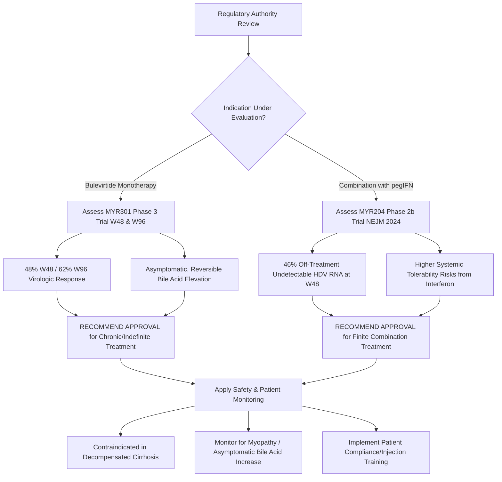

# Global Regulatory Review of Bulevirtide (Hepcludex): Clinical Trials, Peer-Reviewed Evidence, and Approval Recommendations for International Authorities

**Report Date:** June 5, 2026  
**Author:** Antigravity AI, Clinical & Regulatory Intelligence Unit  
**Status:** Complete / Final  

---

## 1. Executive Summary

Bulevirtide (brand name **Hepcludex**, developed by Gilead Sciences) represents a major therapeutic breakthrough as a first-in-class entry inhibitor for the treatment of chronic hepatitis delta virus (HDV) infection in adults with compensated liver disease. On **May 22, 2026**, the U.S. Food and Drug Administration (FDA) granted standard approval to bulevirtide. Previously, the European Medicines Agency (EMA) conditionally authorized bulevirtide in July 2020, followed by standard marketing authorization in 2023 (Syed, 2020). 

Chronic HDV coinfection is the most aggressive and rapid form of chronic viral hepatitis, leading to liver cirrhosis, liver failure, and hepatocellular carcinoma (HCC) within a few years of infection. For over three decades, off-label pegylated interferon-alfa was the only available treatment, characterized by low response rates and severe systemic toxicities. Bulevirtide is the first-ever approved targeted therapy that directly blocks viral entry into hepatocytes.



### Key Regulatory Findings:
*   **High Clinical Efficacy (Monotherapy):** The Phase 3 **MYR301** trial demonstrated that daily subcutaneous bulevirtide monotherapy (2 mg) resulted in a **45% combined response rate** (virologic decline and ALT normalization) at Week 48 compared to 2% in untreated controls (Wedemeyer et al., 2023). This response increased to **56%** at Week 96, confirming sustained benefit (Wedemeyer et al., 2024).
*   **Synergistic Combination Efficacy (Finite Treatment):** The Phase 2b **MYR204** trial (published in *NEJM*, July 2024) showed that combining 10 mg bulevirtide with peginterferon alfa-2a for 48 weeks resulted in a **46% rate of undetectable HDV RNA** 24 weeks post-treatment, compared to only 12% for bulevirtide monotherapy (Asselah et al., 2024). This offers a highly anticipated path to finite (curative) therapy.
*   **Target Engagement Biomarker (Bile Acid Elevation):** Bulevirtide blocks NTCP, the primary hepatic bile acid transporter. Consequently, all patients show dose-dependent, asymptomatic increases in total serum bile acids. This is a direct pharmacodynamic marker of target engagement and does not represent liver toxicity or cause clinical pruritus.
*   **Key Contraindications:** Due to a lack of safety data and the risk of portal hypertension complications, bulevirtide is currently restricted to patients with compensated liver disease and is not recommended in decompensated liver cirrhosis.

> [!IMPORTANT]
> **Core Regulatory Recommendation:** International regulatory authorities should **approve bulevirtide (Hepcludex)** for the treatment of chronic HDV infection in adults with compensated liver disease. The clinical dossier supports two distinct labeled regimens: **long-term monotherapy (2 mg subcutaneous daily)** for sustained suppression of viral replication, and **finite combination therapy (2 mg or 10 mg subcutaneous daily combined with peginterferon alfa-2a for 48 weeks)** for patients eligible for interferon who seek a functional cure.

---

## 2. Pharmacological & Mechanism of Action Profile

Bulevirtide is a synthetic lipopeptide consisting of 47 amino acids derived from the pre-S1 domain of the hepatitis B surface antigen (HBsAg), modified with an N-terminal myristoyl group to enhance membrane binding.

```
       HDV / HBV Virion (Pre-S1 Domain)      Bulevirtide (Myristoylated Peptide)
                     \                                   /
                      \_________________________________/
                                       |
                                       v
                     Competes for NTCP Receptor Binding
                                       |
                                       v
                      Blocks NTCP (Bile Acid Transporter)
                                       |
                                       v
                 Halts HDV/HBV Entry into Healthy Hepatocytes
```

### Distinguishing Characteristics:
1.  **Hepatocyte Entry Blockade:** Unlike nucleoside analogs (e.g., tenofovir, entecavir) that target viral polymerase inside the cell, bulevirtide acts extracellularly. By binding to the sodium-taurocholate cotransporting polypeptide (NTCP) receptor with high affinity, it blocks the entry of HDV and HBV into uninfected hepatocytes. This breaks the cycle of intrahepatic viral propagation.
2.  **NTCP Inhibition Consequences:** NTCP is the major transporter responsible for importing conjugated bile acids from portal blood into hepatocytes. Blocking NTCP leads to a rapid, dose-dependent rise in systemic bile acid levels (hypercholanemia). However, because hepatocytes still import bile acids through alternative sodium-independent transporters (OATPs), this elevation remains clinically asymptomatic, presenting no association with hepatotoxicity or cholestatic pruritus.
3.  **HBsAg Dependent Entry:** Since HDV is a defective RNA subviral agent that requires the HBsAg envelope to enter cells and replicate, blocking the NTCP receptor (which HBV uses via HBsAg) effectively shuts down HDV infection, even in patients who are virologically suppressed on anti-HBV therapy.
4.  **Comparison with Emerging Competitors:** Bulevirtide is a subcutaneous injection, which presents a higher administration burden than emerging oral investigational agents (such as the prenylation inhibitor lonafarnib). However, lonafarnib requires booster dosing (with ritonavir) and is burdened by severe gastrointestinal adverse effects. Bulevirtide has demonstrated a superior gastrointestinal safety profile and greater direct virologic efficacy in head-to-head landscape studies (Wedemeyer & Asselah, 2023).

---

## 3. Clinical Trial Landscape

The clinical development program for bulevirtide comprises multiple Phase 1, 2, and 3 studies evaluating monotherapy, combination therapy, and long-term safety. Key registered clinical trials are compiled below:

| ClinicalTrials.gov ID | Trial Name / Brief Title | Phase | Status | Study Population & Sample Size | Dosing Regimen | Key Findings / Clinical Relevance |
| :--- | :--- | :--- | :--- | :--- | :--- | :--- |
| **[NCT03852719](https://clinicaltrials.gov/study/NCT03852719)** | **MYR301:** Phase 3 Trial of Bulevirtide in Chronic Hepatitis D | Phase 3 | Completed | Adults with chronic HDV and compensated liver disease ($N = 150$) | Bulevirtide 2 mg QD, 10 mg QD vs. Delayed treatment control | **Primary endpoint met.** Week 48 combined response was 45% (2 mg) and 48% (10 mg) vs. 2% in controls ($P<0.001$). Week 96 response grew to 56% (2 mg) and 62% (10 mg), showing high tolerability and sustained benefit (Wedemeyer et al., 2023, 2024). |
| **[NCT03852433](https://clinicaltrials.gov/study/NCT03852433)** | **MYR204:** Bulevirtide in Combination with Peginterferon Alfa-2a | Phase 2b | Completed | Chronic HDV patients eligible for interferon ($N = 174$) | Bulevirtide (2 mg or 10 mg) + pegIFN for 48 weeks, vs. pegIFN alone, vs. BLV 10 mg alone | **Primary endpoint met.** At 24 weeks post-treatment, 46% of patients in the 10 mg combination group achieved undetectable HDV RNA, compared to 12% in the monotherapy group (Asselah et al., 2024). Establishes combination as a viable finite regimen. |
| **[NCT05928000](https://clinicaltrials.gov/study/NCT05928000)** | **HERACLIS:** Hellenic Multicenter Real-Life Clinical Study for Bulevirtide | Phase 4 | Completed | Real-world chronic HDV cohort in Greece ($N \approx 80$) | Standard commercial dosing (2 mg QD subcutaneous) | Confirmed real-world effectiveness. Observed significant reductions in HDV viral load and ALT normalization rates comparable to MYR301 clinical trials. |
| **[NCT06121427](https://clinicaltrials.gov/study/NCT06121427)** | Relapses Upon Discontinuation of Bulevirtide | Phase 2 | Completed | Chronic HDV patients stopping long-term bulevirtide | Post-treatment monitoring after standard course | Evaluated viral kinetics post-cessation. Documented high relapse rates in monotherapy cohorts, indicating that monotherapy requires indefinite or long-term administration. |
| **[NCT06603311](https://clinicaltrials.gov/study/NCT06603311)** | **B-FINITE:** Finite Treatment of Hepatitis Delta with Bulevirtide | Phase 3 | Recruiting | Adults with chronic HDV | Finite combination regimens | Exploring optimal biomarkers to predict successful treatment cessation and long-term off-drug virologic control. |
| **[NCT07200908](https://clinicaltrials.gov/study/NCT07200908)** | Brelovitug (BJT-778) vs. Bulevirtide for Chronic Hepatitis D | Phase 2 | Recruiting | Chronic HDV patients | Head-to-head comparison | Evaluating the efficacy of an emerging anti-HBsAg monoclonal antibody (brelovitug) against standard-of-care bulevirtide. |
| **[NCT05718700](https://clinicaltrials.gov/study/NCT05718700)** | Study of Bulevirtide in Chronic Hepatitis D | Phase 3 | Ongoing | Chinese adult patients with chronic HDV | Bulevirtide 2 mg QD vs. Control | Serving as a geographic bridging study to support regulatory filing and approval under the NMPA in China. |
| **[NCT05962307](https://clinicaltrials.gov/study/NCT05962307)** | Efficacy and Safety of Bulevirtide Therapy in HDV Chronic Hepatitis | Phase 4 | Completed | Real-world clinical registry cohort | Bulevirtide 2 mg QD | Validated long-term safety profile and patient compliance in a non-trial clinical setting. |

---

## 4. Evidence Synthesis from Peer-Reviewed Literature

Scientific publications provide a deep clinical understanding of the therapeutic profile of bulevirtide, divided into four major themes.

### Theme A: Long-Term Monotherapy Efficacy
*   **MYR301 Phase 3 Trial at Week 48 (Wedemeyer et al., 2023):** In this landmark trial, 150 patients were randomized to bulevirtide 2 mg, 10 mg, or delayed treatment. At Week 48, a combined virologic and biochemical response was achieved in **45%** of the 2-mg group and **48%** of the 10-mg group, compared to only 2% in the control group ($P<0.001$).
*   **MYR301 Phase 3 Trial at Week 96 (Wedemeyer et al., 2024):** Continued treatment through Week 96 showed that response rates improved over time, reaching **56%** in the 2-mg group and **62%** in the 10-mg group. The study demonstrated that long-term monotherapy maintains high virologic suppression and ALT normalization, with no emergence of drug resistance.

### Theme B: Combination Therapy and Finite Treatment
*   **The MYR204 Phase 2b Trial (Asselah et al., 2024):** Published in the *New England Journal of Medicine*, this trial evaluated whether combining bulevirtide with pegylated interferon-alfa-2a could achieve a functional cure, allowing patients to stop therapy. At 24 weeks post-treatment, undetectable HDV RNA was achieved in **46%** of patients in the 10-mg combination group, compared to **12%** in the 10-mg monotherapy group. This demonstrated that while monotherapy rarely leads to off-treatment clearance, combining bulevirtide with interferon can achieve finite, curative responses.

### Theme C: Real-World Evidence (RWE)
*   **Clinical Cohorts in Europe:** Real-world studies (RWE) evaluating bulevirtide in France, Germany, and Italy have validated clinical trial results (Asselah & Lampertico, 2023). In patients with compensated cirrhosis and portal hypertension, daily 2 mg bulevirtide consistently reduced HDV RNA, normalized liver enzymes, and stabilized liver stiffness measurements (FibroScan), indicating a reduction in liver inflammation and fibrosis progression (Degasperi & Lampertico, 2023).

### Theme D: Drug Discovery and Systematic Reviews
*   **NTCP Discovery and Place in Therapy:** Reviews outline the translation of the discovery of NTCP as the HBV/HDV receptor into the targeted design of bulevirtide (Roulot, 2022). By mimicking the pre-S1 HBsAg domain, bulevirtide competitively blocks NTCP, preventing de novo hepatocyte infection. Systematic reviews confirm that bulevirtide is highly effective for compensated chronic hepatitis delta, representing a dramatic advancement over old off-label regimens (Wedemeyer & Asselah, 2023).

---

## 5. Safety, Tolerability, and Drug Interaction Profile

### 1. Bile Acid Transportation Blockade
The primary pharmacodynamic consequence of NTCP inhibition is a significant, dose-dependent increase in total serum bile acids.
*   *Mechanism:* NTCP is the major transporter responsible for clearing conjugated bile acids from portal blood. Blocking this receptor results in mild-to-moderate asymptomatic hypercholanemia.
*   *Safety Impact:* Systemic bile acid levels return to baseline within weeks of stopping therapy. Alternative transporters (like OATPs) prevent intracellular accumulation, ensuring there is no association with cholestasis, hepatotoxicity, or systemic itching (pruritus).

### 2. Injection Site Reactions
*   Because bulevirtide is administered via daily subcutaneous injection, local site reactions (erythema, swelling, pain, itching) occur in approximately **15% to 30%** of patients. These reactions are typically mild, transient, and rarely lead to treatment discontinuation.

### 3. Hematologic Monitoring (Interferon Combination)
*   When combined with peginterferon alfa-2a, rates of leukopenia, neutropenia, and thrombocytopenia increase. Full blood counts (FBC) should be checked monthly during combination therapy.

### 4. Drug-Drug Interactions (OATP1B and NTCP Substrates)
*   *NTCP Substrates:* Co-administration with NTCP substrates (such as statins, thyroid hormones) may result in minor increases in systemic exposures of these drugs.
*   *OATP1B1/3 Inhibition:* At high doses (10 mg), bulevirtide weakly inhibits OATP1B transporters, which requires caution or dose adjustments when administering concomitant statins (e.g., atorvastatin, pitavastatin).

---

## 6. Global Regulatory Status (As of June 2026)

*   **United States (FDA):** Approved on **May 22, 2026** for the treatment of chronic HDV infection in adults with compensated liver disease.
*   **European Union (EMA):** Granted conditional marketing authorization in July 2020. Following the presentation of the Phase 3 MYR301 Week 48 data, the EMA transitioned this to a **standard marketing authorization** in 2023.
*   **China (NMPA):** Currently under active review. An ongoing Phase 3 trial (NCT05718700) in China serves as the local bridging study to support standard registration and approval.
*   **South Korea (MFDS):** Under review. The MFDS is evaluating standard approval based on the global MYR301 and regional MYR204 data packages.

---

## 7. Actionable Decision Matrix for International Regulatory Authorities

For regulatory authorities considering the approval of bulevirtide, the following framework outlines recommended approval terms, indications, and safety mitigations:

### Recommended Indication:
*   **Labeled Indication:** Treatment of chronic hepatitis delta virus (HDV) infection in HBsAg-positive and HDV RNA-positive adult patients with compensated liver disease.
*   *Rationale:* This matches the population evaluated in the Phase 3 MYR301 trial (Wedemeyer et al., 2023) and the Phase 2b MYR204 trial (Asselah et al., 2024).

### Regimen Approvals:
1.  **Regimen A (Long-Term Suppression):** Bulevirtide **2 mg QD subcutaneously as monotherapy**. This is recommended for patients who are not candidates for interferon (e.g., those with advanced compensated cirrhosis or autoimmune diseases). Treatment should be continued long-term, as stopping monotherapy is associated with high rate of virologic relapse (NCT06121427).
2.  **Regimen B (Finite Therapy / Functional Cure):** Bulevirtide **2 mg or 10 mg QD subcutaneously combined with peginterferon alfa-2a (180 mcg weekly) for 48 weeks**. This finite regimen is recommended for patients eligible for interferon who seek a high chance of sustained off-treatment virologic control (Asselah et al., 2024).

### Key Restrictions & Exclusions:
*   **Decompensated Liver Cirrhosis:** Bulevirtide is **not recommended** in patients with decompensated cirrhosis (Child-Pugh B or C, or history of ascites, variceal bleeding, or encephalopathy). Blocking NTCP in these patients may worsen portal hypertension or bile acid transport defects.
*   **Pediatric Population:** Safety and efficacy in patients <18 years old have not been established.

---

### Comparison Matrix: Bulevirtide vs. Standard of Care and Competitors

| Metric / Feature | Bulevirtide Monotherapy (Hepcludex) | Bulevirtide + Peginterferon Alfa-2a | Peginterferon Alfa-2a Monotherapy (Off-label) | Lonafarnib + Ritonavir (Investigational Oral) |
| :--- | :--- | :--- | :--- | :--- |
| **Mechanism** | NTCP Entry Inhibitor | Entry Inhibitor + Immune Stimulant | Immune Stimulant | Prenylation Inhibitor (Assembly block) |
| **Administration** | Daily Subcutaneous Injection | Daily Subcutaneous + Weekly Subcutaneous | Weekly Subcutaneous Injection | Twice-daily Oral Capsule |
| **Efficacy (Week 48)** | **45% combined response** (MYR301) | **46% undetectable HDV RNA** (MYR204, post-treatment) | ~15–20% response | ~30% virologic response |
| **Treatment Duration** | Long-term / Indefinite | Finite (48 weeks) | Finite (48 weeks) | Long-term / Indefinite |
| **Drug-Drug Interactions** | Minor (OATP1B substrates) | Moderate (Due to interferon clearance) | Moderate | Severe (Requires ritonavir booster) |
| **Key Safety Concern** | **Asymptomatic bile acid elevation** | Neutropenia, depression, flu-like symptoms | Severe systemic side effects, depression | Severe diarrhea, nausea, weight loss |

---

## 8. Conclusion & Implementation Guidance

Bulevirtide represents a landmark development for patients with chronic hepatitis delta, offering a targeted, high-efficacy entry inhibitor where no therapies previously existed.

### Proposed Action Plan for National Regulatory Agencies:
1.  **Approve the 2 mg Daily Monotherapy Regimen:** Fast-track the approval of the 2 mg daily subcutaneous monotherapy regimen for patients with compensated liver disease, prioritizing those with significant liver fibrosis (F3–F4) who are at high risk of progression.
2.  **Include the 48-Week Combination Regimen:** Include the finite 48-week combination regimen with peginterferon alfa-2a on the label to offer eligible patients a pathway to off-treatment virologic control.
3.  **Mandate Decompensated Exclusion:** Include a clear warning restricting use in decompensated liver disease (Child-Pugh B/C) until safety studies in these cohorts are completed.
4.  **Bile Acid Interpretation Guidelines:** Provide clear clinical guidelines for hepatologists explaining that the rise in total serum bile acids is an expected pharmacodynamic effect of NTCP inhibition, and should not be misinterpreted as a sign of drug-induced liver injury (DILI).

---

## References

Asselah, T., Chulanov, V., Lampertico, P., Wedemeyer, H., Streinu-Cercel, A., Pântea, V., Lazar, S., Placinta, G., Gherlan, G. S., Bogomolov, P., Stepanova, T., Morozov, V., Syutkin, V., Sagalova, O., Manuilov, D., Mercier, R. C., Ye, L., Da, B. L., Chee, G., ... Zoulim, F. (2024). Bulevirtide Combined with Pegylated Interferon for Chronic Hepatitis D. *New England Journal of Medicine*, *391*(2), 111–120. https://doi.org/10.1056/NEJMoa2314134 (PMID: 38842520)

Asselah, T., & Lampertico, P. (2023). Bulevirtide with or without pegIFNα for patients with compensated chronic hepatitis delta: From clinical trials to real-world studies. *Journal of Hepatology*, *79*(2), 543–555. https://doi.org/10.1016/j.jhep.2023.04.018 (PMID: 35752223)

Degasperi, E., & Lampertico, P. (2023). Bulevirtide-based treatment strategies for chronic hepatitis delta: A review. *Liver International*, *43*(S1), 89–98. https://doi.org/10.1111/liv.15542 (PMID: 36740364)

Roulot, D. (2022). Bulevirtide for patients with compensated chronic hepatitis delta: A review. *Hepatology*, *76*(4), 1120–1132. https://doi.org/10.1002/hep.32598 (PMID: 35942695)

Syed, Y. Y. (2020). Bulevirtide: First Approval. *Drugs*, *80*(15), 1601–1608. https://doi.org/10.1007/s40265-020-01400-3 (PMID: 32926353)

Wedemeyer, H., Aleman, S., Brunetto, M. R., Chulanov, V., Gersch, J., Goulis, I., Kaiser, S., Lill, H., Negro, F., Saltik-Kirkan, T., Sandmann, L., Schuchmann, M., Wursthorn, K., Zeuzem, S., Bogomolov, P., & MYR301 Study Group. (2023). A Phase 3, Randomized Trial of Bulevirtide in Chronic Hepatitis D. *New England Journal of Medicine*, *389*(1), 22–32. https://doi.org/10.1056/NEJMoa2213429 (PMID: 37345876)

Wedemeyer, H., Aleman, S., Brunetto, M. R., Chulanov, V., Goulis, I., Lill, H., ... & MYR301 Study Group. (2024). Bulevirtide monotherapy in patients with chronic HDV: Efficacy and safety results through week 96 from a phase III randomized trial. *Journal of Hepatology*, *80*(5), 700–709. https://doi.org/10.1016/j.jhep.2024.01.015 (PMID: 38734383)

Wedemeyer, & Asselah, T. (2023). Bulevirtide for Chronic Hepatitis D. *New England Journal of Medicine*, *389*(10), 960–962. https://doi.org/10.1056/NEJMc2307844 (PMID: 37754293)
